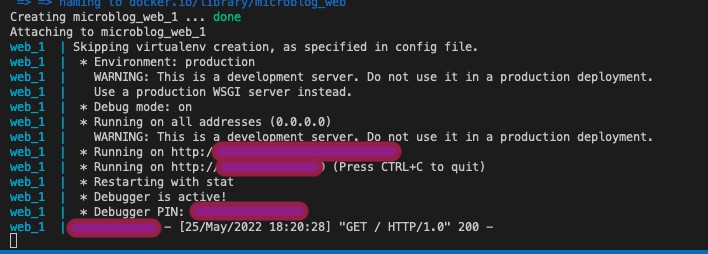
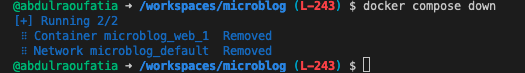

# My Microblog

## Guidance

This README is structured like this:

- A repository map
- Application Features
- Devops practices exercised

### Application Features

#### The concepts covered are :

- Templates
- Conditional Statements
- Loops
- Templates
- Web Forms
- View Forms

#### The DevOps Practices used and their application:

- Package Management: Poetry
- Containerisation: Docker
- Continious Integration: GitHub Actions / Docker
- Continious Delivery: GitHub Actions / Dockerhub / Heroku

## System Requirements

The project uses poetry for Python to create an isolated environment and manage package dependencies. To prepare your system, ensure you have an official distribution of Python version 3.7+ and install poetry using one of the following commands (as instructed by the [poetry documentation](https://python-poetry.org/docs/#system-requirements)):

### Poetry installation (Bash)

```bash
curl -sSL https://raw.githubusercontent.com/python-poetry/poetry/master/get-poetry.py | python -
```

### Poetry installation (PowerShell)

```powershell
(Invoke-WebRequest -Uri https://raw.githubusercontent.com/python-poetry/poetry/master/get-poetry.py -UseBasicParsing).Content | python -

```

Once Poetry is installed, it does not need activating. It can be used in the different ways, see [documentation](https://python-poetry.org/docs/cli/).

### Virtualenv installation and activation

The project also utilises a virtualenv for Python to create isolated environments.

```bash
pip install virtualenv
```

You would then need to create a virtual env. for the project:

```bash
pip -m venv name-of-venv
```

Activate the venv (Mac OS):

```bash
source name-of-venv/bin/activate
```

Activate the venv (Windows OS):

```bash
source name-of-venv/Scripts/activate
```

## Dependencies

The project uses a virtual environment to isolate package dependencies. To create the virtual environment and install required packages, run the following from your preferred shell:

```bash
poetry install
```

To add a dependency:

```bash
poetry add <NAME_OF_DEPENDENCY>
```

## Running the App

Once the all dependencies have been installed and relevant information has been inputted, start the Flask app in development mode within the poetry environment by running:

```bash
poetry run flask run
```

You should see output similar to the following:

```bash
 * Serving Flask app "app" (lazy loading)
 * Environment: development
 * Debug mode: on
 * Running on http://127.0.0.1:5000/ (Press CTRL+C to quit)
 * Restarting with fsevents reloader
 * Debugger is active!
 * Debugger PIN: 226-556-590
```

Now visit [`http://localhost:5000/`](http://localhost:5000/) in your web browser to view the app.

## DevOps Applications - Containerisation

This application utilises a DevOps concept known as Containerisation. Containerisation entails placing a software component and it's environment, dependencies, and configuration, into an insolated unit called a container. This makes it possible to deploy an application consistently on any computing environment, whether on-premise or cloud-based.

To get started, you need to install a containerisation tool. The containerisation tool used for this project was Docker. However, you may find alternatives depending on your Operating System.

### Getting Started with Docker

#### Build and run the Docker Image

This project is built using multi-stage builds. Multi-stage builds are useful to optimise Dockerfiles while keeping them easy to read and maintain. To learn more about multi-stage builds, see [Use multi-stage builds](https://docs.docker.com/develop/develop-images/multistage-build/) from the official Docker documentation.

To build the development environment, run the following command:

```bash
docker build --target development --tag microblog:development .
```

I have built the development environment image, you should see something similar to this:

```bash
(.venv) [L-237 x] {} microblog docker build --target development --tag microblog:development .
[+] Building 10.7s (10/10) FINISHED                                                                                                                                                
 => [base 1/5] FROM docker.io/library/python:3.10.
 => CACHED [base 2/5] WORKDIR /app                                                                                                                                                                0.0s
 => CACHED [base 3/5] RUN apt-get update     && apt-get -y install curl     && curl -sSL https://raw.githubusercontent.com/python-poetry/poetry/master/get-poetry.py | python -                   0.0s
 => CACHED [base 4/5] COPY . /app/                                                                                                                                                                0.0s
 => CACHED [base 5/5] RUN poetry config virtualenvs.create false --local && poetry install                                                                                                        0.0s
 => exporting to oci image format                                                                                                                                                                 8.0s
 => => exporting layers                                                                                                                                                                           0.0s
 => => exporting manifest sha256:784d67e8e26f3f75524debe19ba22ec79cc19aff719a74245c0309c496676b2f                                                                                                 0.0s
 => => exporting config sha256:aa100674e4df152df8ce1ae3cf04ef75d863dc891a0dc4b1b2d8be7e6623fe4b                                                                                                   0.0s
 => => sending tarball                                                                                                                                                                            7.9s
unpacking docker.io/library/microblog:development (sha256:784d67e8e26f3f75524debe19ba22ec79cc19aff719a74245c0309c496676b2f)...done
(.venv) [L-237 x] {} microblog 
```

The next step is to test the local development setup using the following command:

```bash
docker run -p 4000:5000 --mount type=bind,source="$(pwd)"/app,target=/app/app microblog:development
```

You should see see something like this:

```bash
docker run -p 4000:5000 --mount type=bind,source="$(pwd)"/app,target=/app/app microblog:development
Skipping virtualenv creation, as specified in config file.
 * Environment: production
   WARNING: This is a development server. Do not use it in a production deployment.
   Use a production WSGI server instead.
 * Debug mode: off
 * Running on all addresses (0.0.0.0)
   WARNING: This is a development server. Do not use it in a production deployment.
 * Running on http://127.0.0.1:5000
 * Running on http://172.17.0.2:5000 (Press CTRL+C to quit)
```

## Advanced Features of Docker - Docker Compose

Launching containers with long docker run commands can become tedious, and difficult to share with other developers.

### Building your image

The basic principle of `docker compose` is utilised to launch long docker run commands. So, rather than running the aforementioned commands, one could run a simple:

```bash
docker-compose up --build 
```

Note: docker-compose.yml is configured in YAML. To further develop your understanding, please see [this link](https://docs.docker.com/compose/gettingstarted/) --> Docker Compose Getting Started | See step 3

Once running the docker compose command, you should see something similar to this:



When you are ready to tear it all down, simply run ```docker-compose down``` command. The containers will stop and the network will be removed. Below is an expected outcome.



#### Running individual containers

If you wish to run a container seperately, use each command respecitively either:

```bash
docker-compose up web-development
```

```bash
docker-compose up web-production
```

## Application of Continious Integration and Continious Delivery

Continuous Integration (CI) is a DevOps software development practice where developers regularly merge their code changes into a central repository, after which automated builds and tests are run. This repoistory CI pipeline is set in the following manner:

### Continuous Integration

1. It runs Snyk to check for vulnerabilities with the python application
2. It builds the test image
3. It runs the test image, printing the results of the test, if all is well it proceed with the next step;
4. Notification is sent

### Continious Delivery

1. Second job will run upon the success of first job (CI)
2. Docker buildx is set up
3. Docker is authenticated
4. Production image is pushed to docker (using argument  `target: production`)
5. Image deployed on Heroku
6. Notification is sent

### Important Heroku Dockerfile commands and runtime

- If argument `target : <name_of_env>` is set to a specific target, it will upload the target name, the stage by default will upload the last stage. This is because, in our application, it's production, if you were to change this to `test`, the `test` target stage will be pushed to Dockerhub (action name = Pushing to DockerHub )
- The web process must listen for HTTP traffic on $PORT, which is set by Heroku
- EXPOSE in Dockerfile is not respected, but can be used for local testing. Only HTTP requests are supported.

## Automated Testing
- to use pytest

Ideas:
- [ ] - testing field validation
- [ ] - closing of for loop in login.html ()
- [ ] - to see if all packages are installed with correct versions as stated within pyproject.toml
