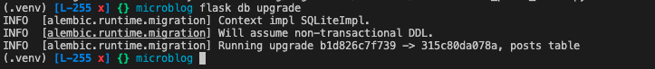

# My Microblog

## Guidance

This README is structured like this:

- A repository map
- Application Features
- DevOps practices exercised

### Application Features

#### The concepts covered are

- Templates
- Conditional Statements
- Loops
- Web Forms
- View Forms
- Receiving Form Data
- Improving Field Validation
- Generating links with `url_for` flask argument
- Databases in Flask
- Database Migration

#### The DevOps Practices used and their application

- Package Management: Poetry
- Containerisation: Docker
- Continious Integration: GitHub Actions / Docker
- Continious Delivery: GitHub Actions / Dockerhub / Heroku
- Database Management: SQLAlchemy, SQLite

## System Requirements

The project uses poetry for Python to create an isolated environment and manage package dependencies. To prepare your system, ensure you have an official distribution of Python version 3.7+ and install poetry using one of the following commands (as instructed by the [poetry documentation](https://python-poetry.org/docs/#system-requirements)):

### Poetry installation (Bash)

```bash
curl -sSL https://raw.githubusercontent.com/python-poetry/poetry/master/get-poetry.py | python -
```

### Poetry installation (PowerShell)

```powershell
(Invoke-WebRequest -Uri https://raw.githubusercontent.com/python-poetry/poetry/master/get-poetry.py -UseBasicParsing).Content | python -

```

Once Poetry is installed, it does not need activating. It can be used in different ways, see [documentation](https://python-poetry.org/docs/cli/).

### Virtualenv installation and activation

The project also utilises a virtualenv for Python to create isolated environments.

```bash
pip install virtualenv
```

You would then need to create a virtual env. for the project:

```bash
pip -m venv name-of-venv
```

Activate the venv (Mac OS):

```bash
source name-of-venv/bin/activate
```

Activate the venv (Windows OS):

```bash
source name-of-venv/Scripts/activate
```

## Dependencies

The project uses a virtual environment to isolate package dependencies. To create the virtual environment and install the required packages, run the following from your preferred shell:

```bash
poetry install
```

To add a dependency:

```bash
poetry add <NAME_OF_DEPENDENCY>
```

## Running the App

Once all dependencies have been installed and relevant information has been inputted, start the Flask app in development mode within the poetry environment by running:

```bash
poetry run flask run
```

You should see output similar to the following:

```bash
 * Serving Flask app "app" (lazy loading)
 * Environment: development
 * Debug mode: on
 * Running on http://127.0.0.1:5000/ (Press CTRL+C to quit)
 * Restarting with fsevents reloader
 * Debugger is active!
 * Debugger PIN: 226-556-590
```

Now visit [`http://localhost:5000/`](http://localhost:5000/) in your web browser to view the app.

## DevOps Applications - Containerisation

This application utilises a DevOps concept known as Containerisation. Containerisation entails placing a software component and its environment, dependencies, and configuration, into an insolated unit called a container. This makes it possible to deploy an application consistently in any computing environment, whether on-premise or cloud-based.

To get started, you need to install a containerisation tool. The containerisation tool used for this project was Docker. However, you may find alternatives depending on your Operating System.

### Getting Started with Docker

#### Build and run the Docker Image

This project is built using multi-stage builds. Multi-stage builds are useful to optimise Dockerfiles while keeping them easy to read and maintain. To learn more about multi-stage builds, see [Use multi-stage builds](https://docs.docker.com/develop/develop-images/multistage-build/) from the official Docker documentation.

To build the development environment, run the following command:

```bash
docker build --target development --tag microblog:development .
```

I have built the development environment image, you should see something similar to this:

```bash
(.venv) [L-237 x] {} microblog docker build --target development --tag microblog:development .
[+] Building 10.7s (10/10) FINISHED                                                                                                                                                
 => [base 1/5] FROM docker.io/library/python:3.10.
 => CACHED [base 2/5] WORKDIR /app                                                                                                                                                                0.0s
 => CACHED [base 3/5] RUN apt-get update     && apt-get -y install curl     && curl -sSL https://raw.githubusercontent.com/python-poetry/poetry/master/get-poetry.py | python -                   0.0s
 => CACHED [base 4/5] COPY . /app/                                                                                                                                                                0.0s
 => CACHED [base 5/5] RUN poetry config virtualenvs.create false --local && poetry install                                                                                                        0.0s
 => exporting to oci image format                                                                                                                                                                 8.0s
 => => exporting layers                                                                                                                                                                           0.0s
 => => exporting manifest sha256:784d67e8e26f3f75524debe19ba22ec79cc19aff719a74245c0309c496676b2f                                                                                                 0.0s
 => => exporting config sha256:aa100674e4df152df8ce1ae3cf04ef75d863dc891a0dc4b1b2d8be7e6623fe4b                                                                                                   0.0s
 => => sending tarball                                                                                                                                                                            7.9s
unpacking docker.io/library/microblog:development (sha256:784d67e8e26f3f75524debe19ba22ec79cc19aff719a74245c0309c496676b2f)...done
(.venv) [L-237 x] {} microblog 
```

The next step is to test the local development setup using the following command: You should see something like this:

```bash
docker run -p 4000:5000 --mount type=bind,source="$(pwd)"/app,target=/app/app microblog:development
Skipping virtualenv creation, as specified in config file.
 * Environment: production
   WARNING: This is a development server. Do not use it in a production deployment.
   Use a production WSGI server instead.
 * Debug mode: off
 * Running on all addresses (0.0.0.0)
   WARNING: This is a development server. Do not use it in a production deployment.
 * Running on http://127.0.0.1:5000
 * Running on http://172.17.0.2:5000 (Press CTRL+C to quit)
```

## Advanced Features of Docker - Docker Compose

Launching containers with long docker run commands can become tedious, and difficult to share with other developers.

### Building your image

The basic principle of docker-compose` is utilised to launch long docker run commands. So, rather than running the aforementioned commands, one could run a simple:

```bash
docker-compose up --build 
```

Note: docker-compose.yml is configured in YAML. To further develop your understanding, please see [this link](https://docs.docker.com/compose/gettingstarted/) --> Docker Compose Getting Started | See step 3

Once running the docker-compose command, you should see something similar to this:


When you are ready to tear it all down, simply run ```docker-compose down``` command. The containers will stop and the network will be removed. Below is an expected outcome.


#### Running individual containers

If you wish to run a container separately, use each command respectively either:

```bash
docker-compose up web-development
```

```bash
docker-compose up web-production
```

## Application of Continuous Integration and Continuous Delivery

Continuous Integration (CI) is a DevOps software development practice where developers regularly merge their code changes into a central repository, after which automated builds and tests are run. This repository CI pipeline is set in the following manner:

### Continuous Integration

1. It runs Snyk to check for vulnerabilities with the python application
2. It builds the test image
3. It runs the test image, printing the results of the test, if all is well it proceeds with the next step;
4. Notification is sent

### Continious Delivery

1. Second job will run upon the success of the first job (CI)
2. Docker buildx is set up
3. Docker is authenticated
4. Production image is pushed to docker (using argument  `target: production`)
5. Image deployed on Heroku
6. Notification is sent

## Detecting and Fixing Dependency Vulnerabilities

This project utilises the `snyk fix` command, `snyk fix` is a new CLI command to apply the recommended updates for supported ecosystems automatically. Snyk CLI bring the functionality of Snyk into the workflow. The CLI can be run locally or in the CI/CD pipeline to scan for vulnerabilities and license issues.

Snyk CLI is Open Source and Supports many languages and tools including Java, .NET, JavaScript, Python, Golang, PHP, C/C++, Ruby, and Scala.

### Pre-requisites

- An account with Snyk
- Snyk CLI Installed
- Snyk CLI authenticated with your device

### Getting Started with Snyk CLI - Local Machine

- Install snyk cli with `npm install -g snyk`
- Authorise your Snyk account with the CLI with `snyk auth, ensure to be logged in before authenticating - Create an account if you do not have one.
- Test your application for vulnerabilities using `snyk test`


- Fix the vulnerability with `snyk fix`


This afore-attached image represents fixing 1 vulnerable path, Pin lxml@4.8.0 to lxml@4.9.1 to fix - ✗ NULL Pointer Dereference (new) [Medium Severity][https://snyk.io/vuln/SNYK-PYTHON-LXML-2940874] in lxml@4.8.0 introduced by pyspelling@2.7.3 > lxml@4.8.0.

### Using Github Actions and Snyk

Run Snyk Monitor on your machine (Any, virtual or local) - Sends a report to your Snyk Dashboard for further monitoring. You can find the latest monitored as a report.  The report will show you a project and how to fix it. You can monitor projects with Snyk Container, Snyk Opensource and Snyk IaC.

### Important Heroku Dockerfile commands and runtime

- If argument `target: <name_of_env>` is set to a specific target, it will upload the target name, the stage by default will upload the last stage. This is because, in our application, it's production, if you were to change this to `test`, the `test` target stage will be pushed to Dockerhub (action name = Pushing to DockerHub )
- The web process must listen for HTTP traffic on $PORT, which is set by Heroku
- EXPOSE in Dockerfile is not respected, but can be used for local testing. Only HTTP requests are supported.

# Database

## Database Migration Repository

The model class created within app/models.py defines the initial database structure (or schema) for this application. As the application will grow, the database schema will require changes to make. is a migration framework used by Flask-Migrate and will enable schema changes without the database being re-created from scratch every time a change needs to be made. Alembic maintains a migration repository, which is a directory in which it stores its migration scripts. Each time a change is made to the database schema, a migration script is added to the repository with the details of the change.

Flask-Migrate exposes its commands through the `flask` command, the `flask` command is utilised through `flask run`, a sub-command native to Flask. The `flask db` sub-command is added by Flask-Migrate to manage everything related to database migrations. To enable easier and safer database migrations the `flask db` sub command was utilised.


## First Database Migration

Upon the development of the migration repository, the first database migration was developed overseeing will the user's table that maps to the User database model.

The command utilised to create the database migration `flask db migrate -m "users table"`. Here, the table created was titled as "users" table.


Explanining what is happening above:

 The first two lines are informational and can be ignored. A user table and two indexes were then found, and then it tells you where it wrote the migration script. The `b1d826c7f739` string is an automatically generated unique code for the migration. The comment given with the -m option is optional, it adds a short descriptive text to the migration.

Discussing what was generated:

TL DR:

Two functions `upgrade()` and `downgrade()`. The `upgrade()` function applies the migration, and the `downgrade()` function removes it. This allows Alembic to migrate the database to any point in the history, to older versions also, by using the downgrade path.

Once the database migration was developed, the changes were applied by evoking `flask db upgrade`


As the application database engine, SQLALchemy, utilises SQLite, the ``

## Database Migration Strategy - Explained

The application is currently in its infancy stage. However, in the case of an application being on a development machine and deployed to a production server and was decided for the next release a new change to the models will be introduced, for example, a new table to be added. Without migration, one would need to figure out how to change the schema of the database, both in development and production.

However, as we have database migration support, models in the application can be modified to generate a new migration script by evoking `flask db migrate`. It is best to review the new model to ensure automatic generation did the right thing. Changes are then applied to the development database by running `flask db upgrade`.

Once the new version is ready to be released to the production environment, one would need to run `flask db upgrade`. Alembic will detect that the production database is not updated to the latest revision of the schema, and run all the new migration scripts that were created after the previous release.

To undo the last migration, `flask db downgrade` command is to be utilised. This command is unlikely to be used during production, however, it can become useful during development should one need to downgrade, delete a migration script then continue to generate a new script to replace it.

## Database Relationship - Explained

Relational databases are good to categorise and storing data which then can be queried and filtered to extract information.

In the case of a user writing a blog post, the user will have a record in the users' table, where the post will have a record in the posts table. An efficient method to record who wrote a given post is to link two related records.

Once a relationship is established, one can perform complex queries such as reversing relationships; finding out which user wrote a certain blog post. Flask-SQLAlchemy can help with both types of queries.

In commit [b5aaf13](https://github.com/abdulraoufatia/microblog/pull/32/commits/b5aaf13caaba9402361a88ccf3a700f2dc3e7be6), app/models.py was modified, and a schema for a new posts table was developed:


Describing the attached image, the database diagram above shows foreign keys as a link between the `user_id` and the `id` fields of the table it refers to. This kind of relationship is called one-to-many because "one" user writes "many" posts.

The `user_id` field is called a *foreign key* as it is the Child key, where as mentioned, the `id` is the primary key. Further describing the image attached, The posts table contains a required `id`, the `body` of the post and the `timestamp`. In addition to these expected fields, a `user_id` field was added, linking the post to its author.

Finally, as updates to the application models were made, a new database migration was needed to be generated by invoking `flask db migrate -m "posts table"`:


The migration was then applied with `flask db upgrade`.



## Interacting with the Database

Start with importing the database instance with:

`from app import db`

and with the two model classes:
`from app.models import User, Post`

### How to create a new user
`u = User(username='john', email='john@example.com')`
The next step would be to write the user to the database, to this, it will be done to the db.session(), db.session represents active sessions which changes can made to:
`db.session.add(u)`

Multiple changes can be accumulated in a session and once all the changes have been registered you can issue a single `db.session.commit()`, which writes all the changes atomically.

`db.session.commit`

 If at any time while working on a session there is an error, a call to db.session.rollback() will abort the session and remove any changes stored in it. From PR fill-in blank, the database contains two users. Queries can be made to the database to answer desired questions.

 ```python
>>> users = User.query.all()
>>> users
[<User john>, <User susan>]
>>> for u in users:
...     print(u.id, u.username)
...
1 john
2 susan
 ```

### Adding a blogpost to the Database 

The example below illustrates the ability to add a blogpost to the database, assigned to user id 1 (John), from the tutorial above. One can erase test users and posts created above. To this, create a for loop to iterate through the users and utilise the db.session.delete() query, and likewise for the posts:

```
>>> users = User.query.all()
>>> for u in users:
...     db.session.delete(u)
...
>>> posts = Post.query.all()
>>> for p in posts:
...     db.session.delete(p)
...
>>> db.session.commit()
```

For further information, please visit the official [Flask-SQLAlchemy](https://flask-sqlalchemy.palletsprojects.com/en/2.x/) documentation many options that are available to query the database.

## Automated Testing

- to use pytest

Ideas:

- [ ] - testing field validation
- [ ] - closing of for loop in login.html ()
- [ ] - to see if all packages are installed with correct versions as stated within pyproject.toml
